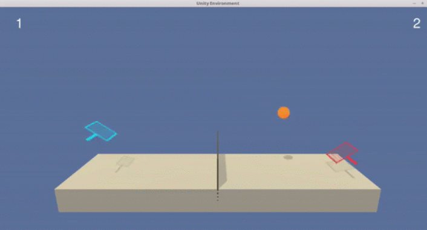

> REINFORCE == **RE**ward **I**ncrement = **N**onnegative **F**actors times **O**ffset **R**einforcement times **C**haracteristic **E**ligibility

#Nice #TattooMaterial - [source](http://www-anw.cs.umass.edu/~barto/courses/cs687/williams92simple.pdf)

# Reinforcement Learning

**Screen captures of solved simulations:**

<table style="width:100%" align="center" valign="center">
  <tr>
    <th width="33.3%">
      

           
            Blackjack
            <a href="1_Blackjack">Details</a>
      

    </th>
    <th>
      

         
          Cliff Walking
          <a href="2_Cliff_Walking">Details</a>
      

    </th>
      </tr>
  <tr>
    <th width="33.3%">
        

         
          Taxi
          <a href="3_Taxi">Details</a>
      

    </th>
    </th width="33.3%">
    <th>

           
            Lunar Lander
            <a href="4_Lunar_Lander">Details</a>
        

    </th>
      </tr>
  <tr>
    <th width="33.3%">
      

           
            Banana Collector
            <a href="5_Banana_Collector">Details</a>
        

    </th>
    <th width="33.3%">
          

           
            Mountain Car
            <a href="6_Mountain_Car">Details</a>
        

    </th>
    </tr>
  <tr>
    <th width="33.3%">
      

           
            Cart Pole
            <a href="7_Cart_Pole">Details</a>
        

    </th>
    <th width="33.3%">
      

           
            Atari Pong
            <a href="8_Atari_Pong">Details</a>
        

    </th>
    </tr>
  <tr>
    <th width="33.3%">
          

           
            Reacher Arms
            <a href="9_Reacher_Robots">Details</a>
        

    </th>
      <th width="33.3%">
          

           
            Two-Player Tennis 
            <a href="10_Tennis">Details</a>
        

    </th>
  </tr>
</table>

A collection of reinforcement learning projects I have done in OpenAI Gym and Unity ML-agents. Learned and implemented basic to complex reinforcement algorithms, from using the **Monte Carlo approach** for solving puzzles to using the **Multi-Agent Deep Deterministic Policy Gradient method** for training table tennis players. Detailed description of each project could be found by clicking on project titles in the table above. 

This is one of the most interesting topic I have had a chance to peek into. However, it definitely contains more mathematical concepts than even most of the other deep learning algorithms (my perspective), but the fact that it is also one of the hardest challenge for some of the smartest minds on Earth is soothing the pain of me needing to open 10 google tabs just to comprehend a page of some paper. 

# Main Topics/Methods

**Monte Carlo Methods** - Epsilon-Greedy policies, GLIE, state and action value functions, Bellman Equations

**Temporal-Different Methods** - Sarsa, Q-Learning, and Expected Sarsa

**Continuous Spaces** - Discretization, Tile Coding, and Function Appoximations

**Value-Based Methods** - Implementation of Deep Q-Networks, Double Q-Networks

**Policy-Based Methods** - Stochastic Policy Search, Hill Climbing Algorithm, REINFORCE, Proximal Policy Optimization, A3C, A2C, N-step bootstrapping, GAE, DDPG, Continuous Control

**Multi-Agent Reinforcement Learning (MARL)** - Cooperative and Competitive Behaviors, Multi-Agent DDPG, Monte Carlo Tree Search

# Resources

### Textbook

[Reinforcement Learning: An Introduction](http://incompleteideas.net/book/the-book-2nd.html) by Richard S. Sutton and Andrew G. Barto. Awesome textbook that is not afraid to go indepth into the mathematics of RL. 

### Paper

- [Human-Level Control through Deep Reinforcement Learning](https://storage.googleapis.com/deepmind-media/dqn/DQNNaturePaper.pdf)
- [Deep Reinforcement Learning with Double Q-Learning](https://arxiv.org/abs/1509.06461)
- [Dueling Network Architectures for Deep Reinforcement Learning](https://arxiv.org/abs/1511.06581)
- [Prioritized Experience Replay](https://arxiv.org/abs/1511.05952)
- [Proximal Policy Optimization Algorithms](https://arxiv.org/abs/1707.06347)
- [Continuous control with deep reinforcement learning](https://arxiv.org/abs/1509.02971)
- [Q-Prop: Sample-Efficient Policy Gradient with An Off-Policy Critic](https://arxiv.org/abs/1611.02247)
- [Multi-Agent Actor-Critic for Mixed Cooperative-Competitive Environments](https://arxiv.org/pdf/1706.02275.pdf?source=post_page---------------------------)

### Structured

The Udacity Nanodegree program provided great assistance. It helped **a lot** with configuring OpenAI Gym and Unity Environments, provided me with pretty good GPU, and even some skeleton of some early projects to pull me through the initial learning curve. However, since the course does not seem to be very popular due to the low demand, it is quite unstructured for someone to resort knowledge on. 
